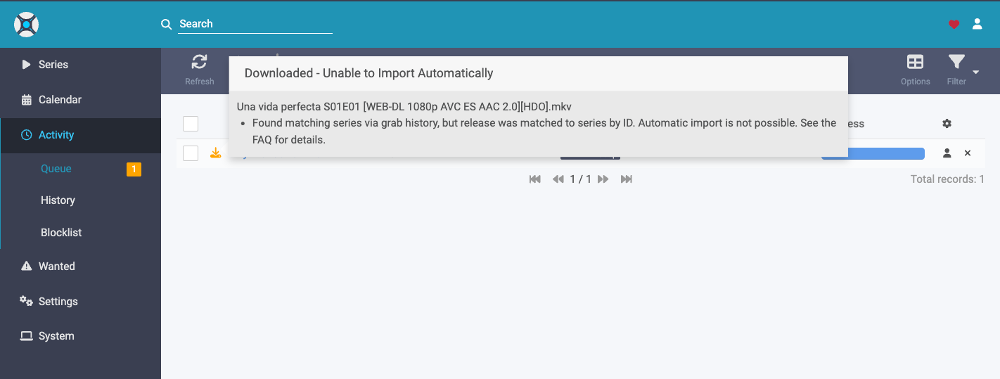
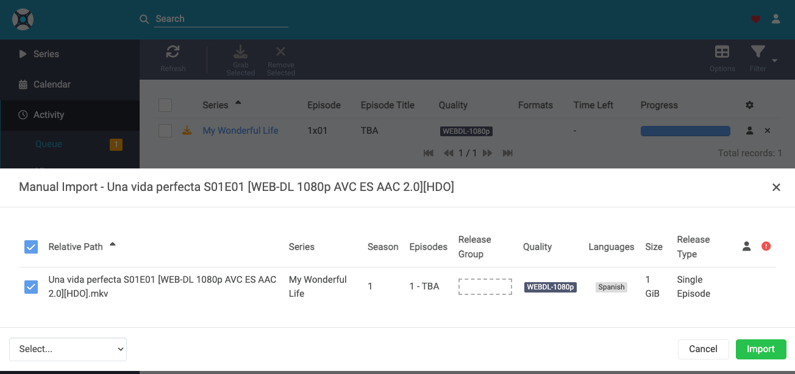
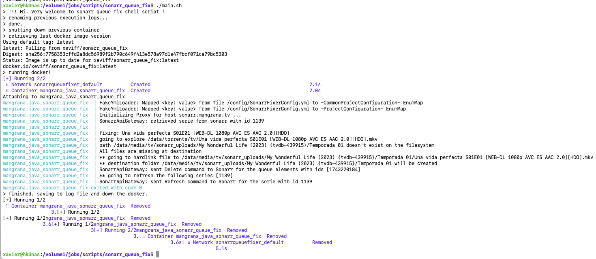
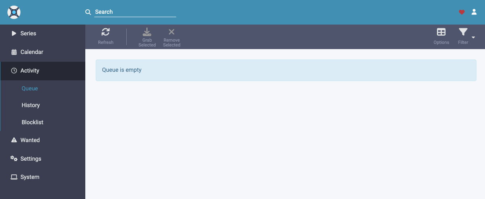
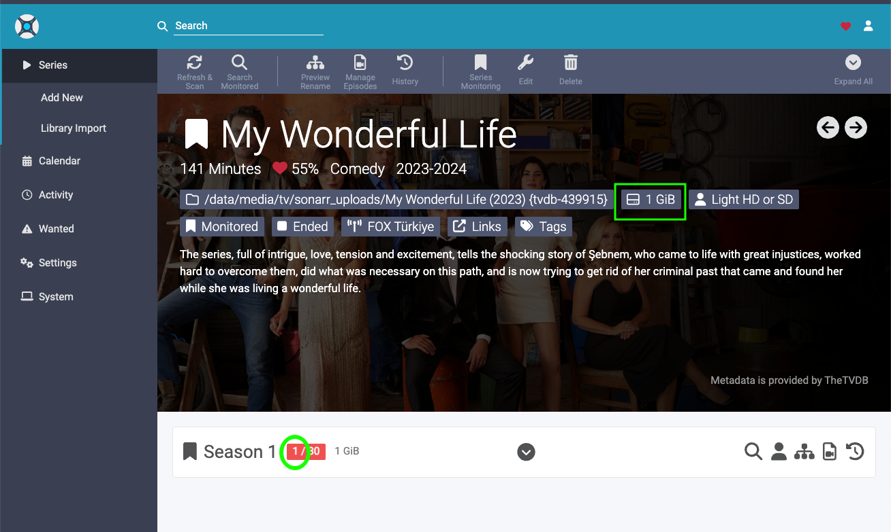

# Motivation
## Common error

### Why this happens?
The truth is I don't know. 
I have alternative ways to add new content to my flows which take a different path (instead of be added to Sonarr first I download them manually) but this happens in the normal path. I mean, I add a TV show to Sonarr, he identifies a download related and downloads it. Once finished he complains about not being able to continue.
This has been happening to me quite much the last year.
### Manual solution

Ok, there is a way to solve it manually, which is click the import icon and fulfill the form (which always asks to input a "Release Group" description), but it means that I have to enter Sonarr regularly to check if there is some "blocked download" and do this repeated action over and over, which after many times it becomes quite tedious.
### The workaround
I definetly don't want to spent more time ever on manual repeated process when I can make a robot do it for me.
So here is the trick! 
1. Ask to Sonarr API the elements on **Activity > Queue** that has the matching warning
2. For every "blocked download" with this problem
   1. Note it's related torrent download folder
   2. Note it's destination folder (the one that Sonarr copies to when all works fine)
   3. Copy, using hardlink option, all the episode video files to destination
3. Clean from queue the elements fixed successfully
4. Refresh the series related to the changes be reflected

This basically imitates the "correct" Sonarr behaviour, skipping the error.
# Result
Here is an example execution:

We can see in the logs that it seems the things have went well.
If I check the Sonarr queue, the warning has gone:

And if we check the TV show detail, we see that now a recognized episode appears (the one related with the download), showing its filesystem fingerprint.

